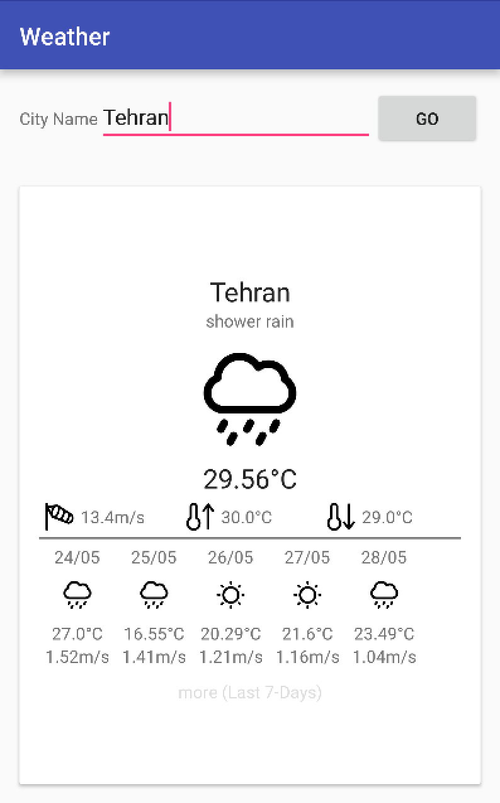

Weather Android Application 
===========================

This repository holds the source code of the Weather Application, a simple Android client for the [Open Weather Map](http://openweathermap.org).
This application was created by [Mohsen Mirhoseini Argi](http://mirhoseini.com), as part of the technical assessment by the [FriendSurance](http://friendsurance.de) team.

--------------------
### What is this repository for? ###

* Weather Android Application
*       Version:  1.0
* Last Update: Sun May 22, 2016

--------------------
### Development Tools ###

* Android Studio v2.1
* gradle-plugin v2.10
* Android SDK Build Tools 23.0.3
* CompileSDKVersion 23

--------------------
### Dependencies ###

* Android Support Tools (recyclerView, cardView, vector,... ) v23.3.0
* Retrofit v2.0.0-beta4
* Okhttp v3.2.0
* Dagger 2.4
* RxJava 1.1.3
* RxAndroid 1.1.0
* Butterknife v8.0.1
* Timber 4.1.2
* AppSettings v1.0.1
* AndroidUtils v1.0.0
* jUnit v4.12
* Android Test v0.4.1
* Mockito v1.10.19

--------------------
### Important Notes ###

The application has one Main Activity which is responsible for presenting weather data for a specific city using its two fragments. Current weather and forecast weather APIs' call are merged using RxJava.

All activity lifecycle and network behaviours are implemented, and according to device size and situation user get a good view and UX. In case having update cache data in Memory or Disk, app do not call Network. If no internet connection, a dialog popup and ask user to turn on it's network.

A combination of cached data in Database and Network call makes Application work smooth and a result a good UX.

Some simple Test Cases was designed to test application UI functionality and inner classes using jUnit and AndroidUnitTest.

### Application Structure ###

The Application implemented and structured bases on the MVP pattern best practice, contributed by [Antonio Leiva](http://antonioleiva.com/mvp-android/).

Whole application functionality is implemented in "Core-Lib" module using pure Java. The "App" module contain all codes required for application to load on Android.

The view (MainActivity), contain a reference to the presenter. The only thing that the view will do is calling a method from the presenter every time there is an interface action.

The presenter (WeatherPresenter), is responsible to act as the middle man between view and model(WeatherInteractor). It retrieves data from the model and returns it formatted to the view. It also decides what happens when you interact with the view.

The model (WeatherInteractor), would only be the gateway to the domain layer or business logic. In this case it provide the data we want to display in the view from Network of cached data from SharedPreferences.

The networking and API call are managed by [Retrofit](http://square.github.io/retrofit/) and OkHttp as its httpclient, contributed by [Square](http://square.github.io). It also shows decent logs while application is running in Debug mode.

Layout parts communications are managed by [RxJava](https://github.com/ReactiveX/RxJava) & [RxAndroid](https://github.com/ReactiveX/RxAndroid) contributed by [ReactiveX](http://reactivex.io).

Dependency Injections are being managed by [Dagger](https://github.com/google/dagger) created by [Square](http://square.github.io) and now maintained by Google [Google](http://google.github.io/dagger/).

The disk cache is managed using [AppSettings](https://github.com/mmirhoseini/app_settings) library, a wrapper for Android SharedPreferences, which takes advantage of HashMaps for faster save and retrieval from memory, developed and published on jCenter by [myself](http://mirhoseini.com).

Whole projects Dependencies are placed in "libraries.gradle" to avoid version conflicts and redundant in different modules.

API provide some icons for different weather conditions, which was converting to in app Vector assets for a better UI.

A part of the application feature was last 7-Day weather history which has been disabled because of openweather payment policy, and the [API was not free](http://openweathermap.org/price).
 
Chachin data to Disk using share preferences was perform by converting weather model to json using Gson, to reach a fast response but it is better to use Parcelable for transfering objects in Android. 